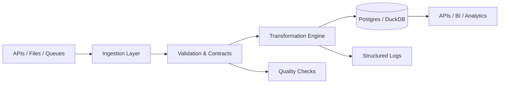

  ## Luiz E. Araujo  
  ```
    Contact: luiz.dataeng@gmail.com
    Open to data engineering projects
```
### > whoami
```bash
Developer specializing in scalable data pipelines
Creator of ForgeFlow - modern async ETL framework
Focus: API ingestion, transformation, multi-warehouse distribution
```
### > tech-stack --list
```yaml
databases:
  - PostgreSQL
  - DuckDB
  - BigQuery
  - Snowflake
  - MongoDB

orchestration:
  - Apache Airflow
  - FastAPI
  - Async/Await

python_tools:
  - Pydantic (validation)
  - Pandas (transformation)
  - HTTPX (async requests)
  - Structlog (observability)
```
### > pipeline-diagram --render

